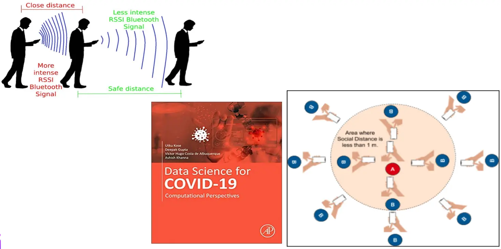
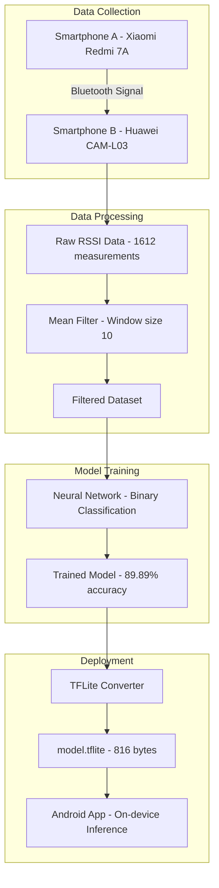
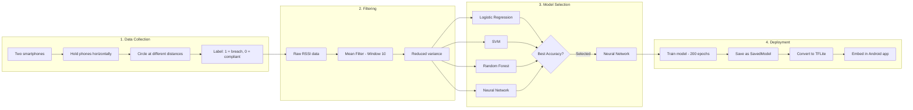
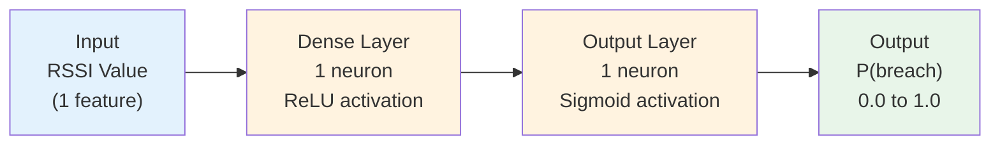
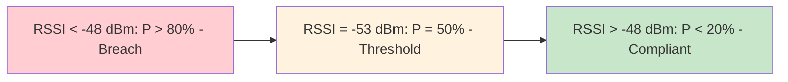
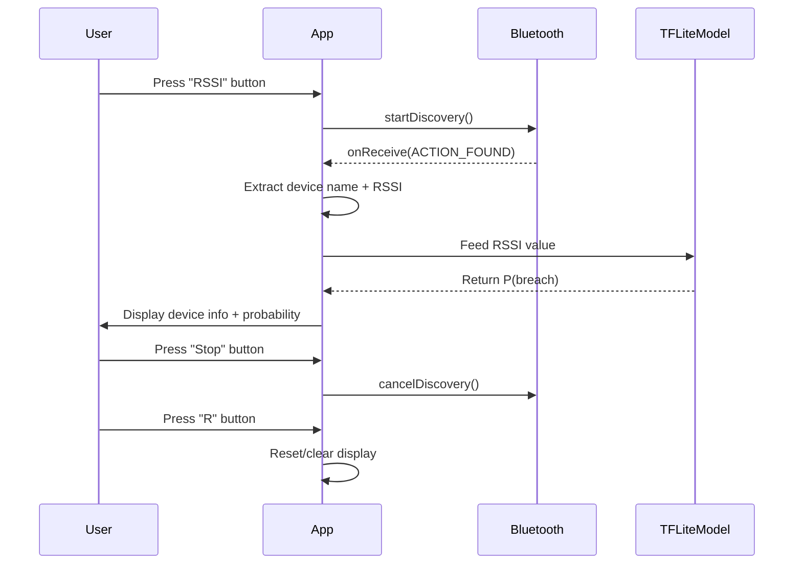

# Data Science for COVID-19

## RSSI-based Social Distancing Mobile App

A mobile application that uses Bluetooth RSSI (Received Signal Strength Indicator) signals from smartphones to determine whether social distancing is being maintained, with an alarm triggered on non-compliance. This project treats social distancing verification as a binary classification problem and embeds a lightweight machine learning model on the device using TensorFlow Lite.

---

<p align="center">
  
</p>

<h1 align="center">Hi, I'm Alvaro Martín</h1>

<p align="center">
  <strong>IoT Developer | Researcher at IoT Research Group UNMSM</strong>
</p>

<p align="center">
  <a href="https://alvaro-martin.github.io/personal-site/">Personal Site</a> ·
  <a href="https://github.com/alvaro-martin">GitHub</a> ·
  <a href="https://linkedin.com/in/almartinuni">LinkedIn</a>
  <a href="https://www.sciencedirect.com/science/chapter/edited-volume/pii/B978012824536100006X">Paper Link</a>
</p>

---

## The Story

> The WHO declared COVID-19 a pandemic on March 11, 2020, recommending social distancing of at least 1 metre as a protective measure. While simple and effective, maintaining this distance in practice is challenging — people often get too close without regard for safety.
>
> I wanted to explore whether smartphones could help enforce social distancing automatically. Bluetooth stood out as the ideal technology: it's ubiquitous in smartphones, costs nothing to use, and consumes less than 40 mW of energy — far less than Wi-Fi or GPS.
>
> Instead of using traditional radio propagation models to estimate distance (which require complex calibration), I framed the problem as **binary classification**: given a Bluetooth RSSI reading, is the social distance of 1 metre being met or not?
>
> After collecting 1,612 RSSI measurements from two smartphones and training a neural network, the model achieved **89.89% accuracy**. The trained model was converted to TensorFlow Lite format (just 816 bytes) so it can run directly on a smartphone without an internet connection.
>
> This research was published by Elsevier in the book *Computational Science and Artificial Intelligence in Healthcare*.

<p align="center">
  
</p>

---

## Project Overview



---

## Project Structure

```
data-science-for-covid19/
├── Data Science for COVID-19.ipynb   # ML pipeline (Google Colab)
├── data_rssi.csv                     # Dataset (1,612 samples)
├── APP_COVID/                        # Android application
│   ├── app/
│   │   ├── src/main/
│   │   │   ├── java/.../             # Java source code
│   │   │   ├── res/                  # Layouts and resources
│   │   │   └── AndroidManifest.xml   # Permissions
│   │   └── build.gradle              # Dependencies (TFLite 2.1.0)
│   ├── build.gradle                  # Project config
│   └── gradle/                       # Gradle wrapper
├── assets/
│   ├── me2.webp                      # Author profile photo
│   ├── rssi.webp                     # Bluetooth RSSI illustration
│   └── paper.pdf                     # Published paper (PDF)
├── LICENSE                           # MIT License
└── README.md
```

---

## Key Results

| Metric | Value |
|---|---|
| **Total Data Points** | 1,612 RSSI measurements |
| **Accuracy (Mean Filtered)** | 89.89% |
| **Accuracy (Raw Data)** | 83.37% |
| **Decision Threshold** | -53 dBm (50% probability) |
| **Certainty Threshold** | < -48 dBm = guaranteed breach |
| **Overlap Zone** | -59 dBm to -48 dBm |
| **Model Size (TFLite)** | 816 bytes |

---

## Methodology

The following diagram illustrates the complete methodology from data collection to model deployment:



### Data Collection

| Parameter | Value |
|---|---|
| **Source Device** | Xiaomi Redmi 7A (Smartphone A) |
| **Scanner Device** | Huawei CAM-L03 (Smartphone B) |
| **Temperature** | 23°C (afternoon), 19°C (night) |
| **Setup** | User A fixed, User B circles at different distances |
| **Labeling** | Within 1m = "1" (breach), Outside 1m = "0" (compliant) |

### RSSI Filtering

Raw RSSI signals are inherently noisy due to:
- **Reflection**: Radio waves bounce off obstacles
- **Diffraction**: Radio waves pass through obstacles
- **Scattering**: Radio waves reradiate in multiple directions
- **Hardware differences**: Varies between smartphone models
- **Environmental factors**: Temperature, humidity, physical obstacles

A **mean filter with window size 10** was applied to reduce variance and narrow the overlap zone between compliant and non-compliant measurements.

---

## Machine Learning Model

### Neural Network Architecture



### Training Configuration

| Parameter | Value |
|---|---|
| **Architecture** | 1 hidden layer (1 neuron, ReLU) + 1 output (sigmoid) |
| **Loss Function** | Binary Cross-Entropy |
| **Optimizer** | Adam (Adaptive Moment Estimation) |
| **Epochs** | 200 |
| **Input** | RSSI value (1 feature) |
| **Output** | Probability of social distancing breach |

### Model Comparison

| Model | Result |
|---|---|
| Simple Logistic Regression | Tested |
| Support Vector Machines | Tested |
| Random Forest | Tested |
| **Neural Network** | **Selected (best accuracy)** |

### Probability Distribution

The model's decision boundary was analyzed by generating 1,000 random RSSI values (0 to 100) and plotting the probability of breach:



- **< -48 dBm**: Probability > 80% — guaranteed breach
- **-53 dBm**: ~50% probability — decision threshold
- **> -48 dBm**: Probability < 20% — compliant

---

## Android App (APP_COVID)

### Application Flow



### Features

- **Bluetooth Discovery**: Scans for nearby Bluetooth devices
- **RSSI Reading**: Extracts signal strength from discovered devices
- **Real-time Display**: Shows device name and RSSI value
- **ML Inference**: TensorFlow Lite model for on-device classification (currently commented out)

### Permissions

| Permission | Purpose |
|---|---|
| `BLUETOOTH` | Basic Bluetooth operations |
| `BLUETOOTH_ADMIN` | Device discovery control |

### Dependencies

```gradle
// build.gradle
implementation 'org.tensorflow:tensorflow-lite:2.1.0'

aaptOptions {
    noCompress "tflite"
    noCompress "lite"
}
```

> **Note**: The TensorFlow Lite inference code in `MainActivity.java` is currently commented out. The app currently performs Bluetooth scanning and RSSI display only. To enable ML inference, uncomment the TFLite code and add the `model.tflite` file to the app's `assets/` directory.

---

## How to Run

### Notebook (Google Colab)

1. Open [Google Colab](https://colab.research.google.com/)
2. Upload `Data Science for COVID-19.ipynb`
3. Upload `data_rssi.csv` to the Colab environment
4. Run all cells sequentially
5. The trained `model.tflite` will be generated and downloaded

**Requirements**:
```bash
numpy
pandas
matplotlib
seaborn
tensorflow
```

### Android App

1. Open the `APP_COVID/` folder in Android Studio
2. Sync Gradle dependencies
3. Connect an Android device (API 29+) or start an emulator
4. Build and run the app
5. Press "RSSI" to start scanning for Bluetooth devices

**Requirements**:
- Android SDK API 29 (minSdk 16)
- Gradle 3.6.1
- TensorFlow Lite 2.1.0

---

## Limitations

Based on the research findings:

- **Behind-user measurements**: When the RSSI measurement is taken behind the user, the body acts as a physical obstacle that attenuates the signal, potentially causing false breach detections. However, the probability of COVID-19 transmission from behind is lower since respiratory droplets travel forward.

- **RSSI instability**: RSSI signals are highly susceptible to environmental conditions. Even with the same device and position, values fluctuate significantly due to reflection, diffraction, and scattering of radio waves.

- **Overlap zone**: The range from -59 dBm to -48 dBm contains overlapping measurements from both classes, creating classification uncertainty in this region.

- **Device dependency**: RSSI characteristics vary between different smartphone models and Bluetooth chipsets, which may affect model generalization.

---

## Future Work

The following extensions are recommended:

- Test different smartphone locations (pockets, bags, holsters)
- Test in different environmental temperatures and humidity conditions
- Test with more smartphones and varying radio interference levels
- Test with different smartphone models to improve generalization
- Implement time windowing approaches for signal processing
- Explore other RSSI filtering techniques (Kalman Filter, Median Filter, EWMA)
- Add real-time alarm system for breach detection
- Extend to multi-person scenarios

---

## Citation

If you use this work, please cite:

```bibtex
@inbook{aspilcueta2021rssi,
  title = {RSSI-based COVID-19 mobile app to comply with social distancing
           using bluetooth signals from smartphones},
  author = {Aspilcueta Narvaez, Alvaro and Guerra Guerra, Jorge},
  booktitle = {Computational Science and Artificial Intelligence in Healthcare},
  publisher = {Elsevier},
  year = {2021},
  doi = {https://doi.org/10.1016/B978-0-12-824536-1.00006-X}
}
```

**Published Article**: [ScienceDirect](https://www.sciencedirect.com/science/chapter/edited-volume/pii/B978012824536100006X)

> A PDF copy of the paper is also available in [`assets/paper.pdf`](assets/paper.pdf).

---

## License

This project is licensed under the MIT License - see the [LICENSE](LICENSE) file for details.

Copyright (c) 2020 Alvaro Martin Aspilcueta Narvaez
